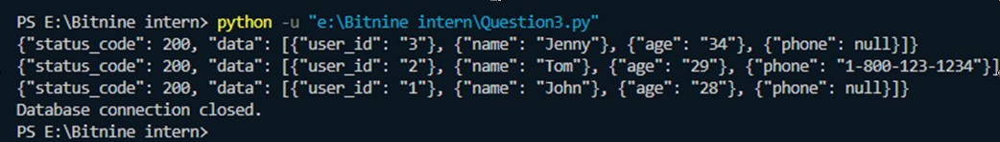

# Question #3

This PostgreSQL driver modification allows you to fetch query results in JSON format, automatically converting rows into JSON strings. This can be useful when working with APIs or other applications that require JSON formatted data.

## Requirements

To use this modified PostgreSQL driver, you need to have the following installed:

- Python 3.x
- psycopg2 library

You can install psycopg2 using pip:

```bash
pip install psycopg2
```

## Development Environment

This modified driver consists of two custom classes:

- JSONConnection: A connection class that uses JSONCursor automatically.
- JSONCursor: A cursor class that returns results as JSON strings.

These classes are defined in the given code snippet and can be saved as a Python file, for example: `json_postgresql_driver.py`.

## How to use the driver

1. Import the required classes from the psycopg2 library and your custom driver file:

```python
import psycopg2
from psycopg2.extras import JSONConnection
```

2. Define a `connect()` function that connects to the PostgreSQL database server using the JSONConnection class:

```python
def connect():
    # Your connection code here
```

3. Inside the `connect()` function, configure the connection parameters with your database credentials:

```python
# Configure connection parameters
db_params = {
    "database": "your_database_name",
    "user": "your_username",
    "password": "your_password",
    "host": "your_host",
    "port": "your_port"
}
```

4. Create a connection to the PostgreSQL database using the modified JSONConnection class:

```python
# Create a connection using JSONConnection
conn = psycopg2.connect(connection_factory=JSONConnection, **db_params)
```

5. Use the JSONCursor to execute queries and fetch results in JSON format:

```python
# Create a cursor using JSONCursor
cur = conn.cursor()

# Execute a query
cur.execute("SELECT * FROM your_table")

# Fetch results in JSON format
results = cur.fetchall()
```

6. Close the cursor and the database connection when finished:

```python
cur.close()
conn.close()
```

7. To use the modified driver, simply call the `connect()` function:

```python
# Connect to the database and fetch results
connect()
```

Now, when you run your Python script, it will connect to your PostgreSQL database, execute a query, and print the results in JSON format.

## Modification in `extras.py`:

The provided code snippet in `extras.py` contains two new classes (`JSONConnection` and `JSONCursor`) that are extending `_connection` and `DictCursor` respectively. These classes enable fetching query results in JSON format.

```python
from psycopg2.extras import _connection, DictCursor
import json

class JSONConnection(_connection):
    """A connection that uses `JSONCursor` automatically."""

    def cursor(self, *args, **kwargs):
        kwargs.setdefault("cursor_factory", self.cursor_factory or JSONCursor)
        return super().cursor(*args, **kwargs)

class JSONCursor(DictCursor):
    """A cursor that returns results as JSON strings."""

    def fetchone(self):
        row = super().fetchone()
        return self._to_json(row)

    def fetchmany(self, size=None):
        rows = super().fetchmany(size)
        return [self._to_json(row) for row in rows]

    def fetchall(self):
        rows = super().fetchall()
        return [self._to_json(row) for row in rows]

    def __iter__(self):
        for row in super().__iter__():
            yield self._to_json(row)

    @staticmethod
    def _to_json(row):
        if row is None:
            return None

        response = {"status_code": 200, "data": []}
        response_data = []

        for key, value in row.items():
            response_data.append({key: value})

        response["data"] = response_data

        return json.dumps(response, default=str)

```

## Output after connecting to the database:


